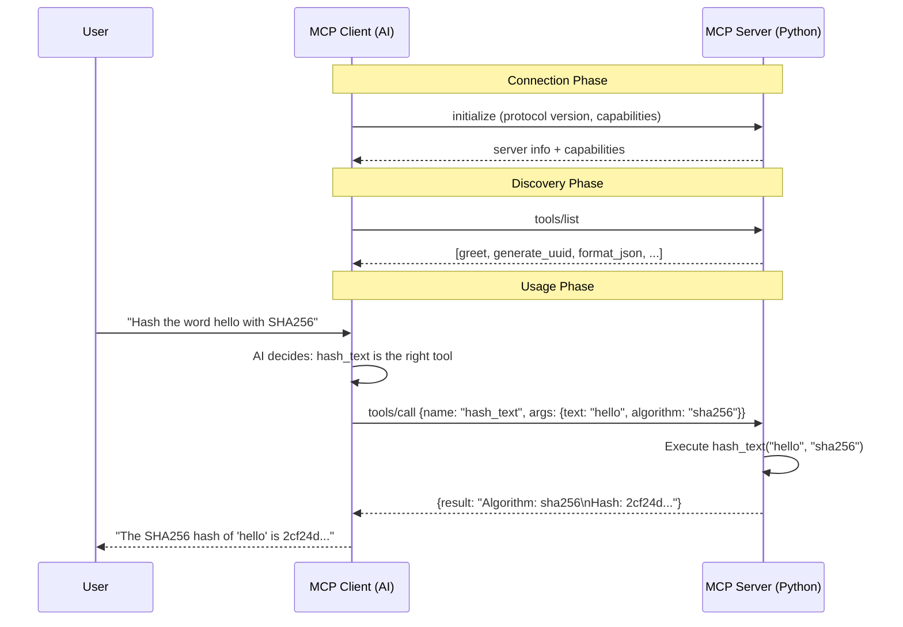

# 🏗️ MCP Server Architecture

> How the DevToolkit MCP Server works under the hood.

---

## System Overview

```
┌──────────────────────────────────────────────────────────────┐
│                        MCP CLIENT                            │
│        (Antigravity / Cursor / Claude Desktop)               │
│                                                              │
│  1. User asks: "Generate a UUID for me"                      │
│  2. AI reads tool descriptions → picks generate_uuid         │
│  3. Sends JSON-RPC call via stdin ──────────────┐            │
│  4. Receives result via stdout ◄────────────────┤            │
└─────────────────────────────────────────────────┤────────────┘
                                                  │
                                          stdio (stdin/stdout)
                                                  │
┌─────────────────────────────────────────────────┤────────────┐
│                     MCP SERVER                  │            │
│                 (server.py — Python)             │            │
│                                                  ▼            │
│  ┌──────────────────────────────────────────────────────┐    │
│  │              FastMCP("DevToolkit")                    │    │
│  │                                                      │    │
│  │  ┌─────────────┐ ┌─────────────┐ ┌──────────────┐   │    │
│  │  │   greet()   │ │generate_uuid│ │ format_json()│   │    │
│  │  └─────────────┘ └─────────────┘ └──────────────┘   │    │
│  │  ┌─────────────┐ ┌─────────────┐ ┌──────────────┐   │    │
│  │  │base64_encode│ │base64_decode│ │  hash_text() │   │    │
│  │  └─────────────┘ └─────────────┘ └──────────────┘   │    │
│  │  ┌─────────────┐ ┌─────────────┐ ┌──────────────┐   │    │
│  │  │ word_count()│ │timestamp    │ │ regex_test() │   │    │
│  │  └─────────────┘ │_convert()   │ └──────────────┘   │    │
│  │                  └─────────────┘                    │    │
│  │  + 10 more tools (API, DB, Advanced)                │    │
│  └──────────────────────────────────────────────────────┘    │
└──────────────────────────────────────────────────────────────┘
```

---

## How MCP Protocol Works

### Communication Flow



### Protocol: JSON-RPC 2.0

MCP uses JSON-RPC 2.0 over stdio. Every message is a JSON object:

**Client → Server (tool call):**
```json
{
  "jsonrpc": "2.0",
  "method": "tools/call",
  "params": {
    "name": "hash_text",
    "arguments": {
      "text": "hello",
      "algorithm": "sha256"
    }
  },
  "id": 1
}
```

**Server → Client (response):**
```json
{
  "jsonrpc": "2.0",
  "result": {
    "content": [{
      "type": "text",
      "text": "Algorithm: sha256\nHash: 2cf24dba..."
    }]
  },
  "id": 1
}
```

---

## Transport Layer: stdio

```
MCP Client (AI IDE)
    │
    │  Spawns subprocess:
    │  python.exe server.py
    │
    ├──stdin──►  JSON-RPC requests
    │
    ◄──stdout──  JSON-RPC responses
    │
    (stderr is for logging only — never read by client)
```

**Why stdio?**
- No ports, no HTTP, no network — just process I/O
- Secure — server runs locally, no external access
- Simple — client starts the server, communicates directly
- Fast — no network overhead

**Alternative:** SSE (Server-Sent Events) transport for remote/HTTP servers.

---

## Tool Registration: How @mcp.tool() Works

```
Your Code                          What MCP Generates
──────────────                     ──────────────────

@mcp.tool()                        Tool Schema:
def hash_text(                     {
    text: str,            ───►       "name": "hash_text",
    algorithm: str = "sha256"        "description": "Hash text using...",
) -> str:                            "inputSchema": {
    """Hash text using a               "type": "object",
    specified algorithm."""            "properties": {
    ...                                  "text": {"type": "string"},
                                         "algorithm": {
                                           "type": "string",
                                           "default": "sha256"
                                         }
                                       },
                                       "required": ["text"]
                                     }
                                   }
```

**FastMCP auto-generates the tool schema from:**
1. **Function name** → `tool.name`
2. **Docstring** → `tool.description` (AI reads this to decide when to use it)
3. **Type hints** → `inputSchema.properties` (types become JSON Schema types)
4. **Default values** → `inputSchema.properties[x].default` + removed from `required`

---

```
mcp-server/
├── app.py                 # Shared FastMCP instance
├── server.py              # Entry point (stdio transport)
├── server_sse.py          # Entry point (SSE/HTTP transport)
├── validators.py          # Input validation & security (Phase 7)
├── tools/
│   ├── dev_tools.py       # 9 core tools (Phase 1)
│   ├── api_tools.py       # 3 async API tools (Phase 3)
│   ├── db_tools.py        # 4 database CRUD tools (Phase 4)
│   └── advanced_tools.py  # 3 advanced tools (Phase 6)
├── resources/
│   └── system_resources.py # 6 resources (Phase 2)
├── prompts/
│   └── code_prompts.py    # 3 prompts (Phase 2)
├── db/
│   └── database.py        # SQLite setup & connection
├── tests/
│   └── test_validators.py # 37 unit tests (Phase 7)
└── venv/                  # Python virtual environment (not in git)
```

### Modular Architecture

The server uses a modular structure where each module registers its
tools/resources/prompts via decorators on a shared `mcp` instance:

- `app.py` creates the shared `FastMCP` instance (like `const app = express()`)
- Each module imports `mcp` from `app.py` and uses `@mcp.tool()` decorators
- `server.py` imports all modules — decorators run on import, registering everything
- Validators provide centralized input validation (Phase 7)

---

## Adding a New Tool: Checklist

```python
# 1. Import any needed library (at top of file)
import some_library

# 2. Add the tool (before the if __name__ block)
@mcp.tool()
def my_new_tool(param1: str, param2: int = 10) -> str:
    """Clear description of what this tool does.   ← AI reads this!

    Args:
        param1: What this parameter is for
        param2: What this parameter is for (default: 10)
    """
    try:
        result = some_library.do_something(param1, param2)
        return f"Result: {result}"
    except Exception as e:
        return f"❌ Error: {str(e)}"        ← Always handle errors!

# 3. Test with: mcp dev server.py
# 4. Commit and push
```

---

## Design Decisions

| Decision | Choice | Rationale |
|---|---|---|
| Framework | FastMCP (not low-level SDK) | Simpler, decorator-based, less boilerplate |
| Transport | stdio + SSE | stdio for local, SSE for remote |
| Architecture | Modular (separate files per phase) | Scalable, maintainable, clear separation |
| Error handling | Return error strings + validation | Don't crash — AI can read errors and retry |
| Input validation | Centralized `validators.py` | DRY, testable, like Express middleware |
| Output format | Formatted strings with emojis | Human-readable, AI can parse it too |
| Database | SQLite | Built-in, serverless, good for learning |
